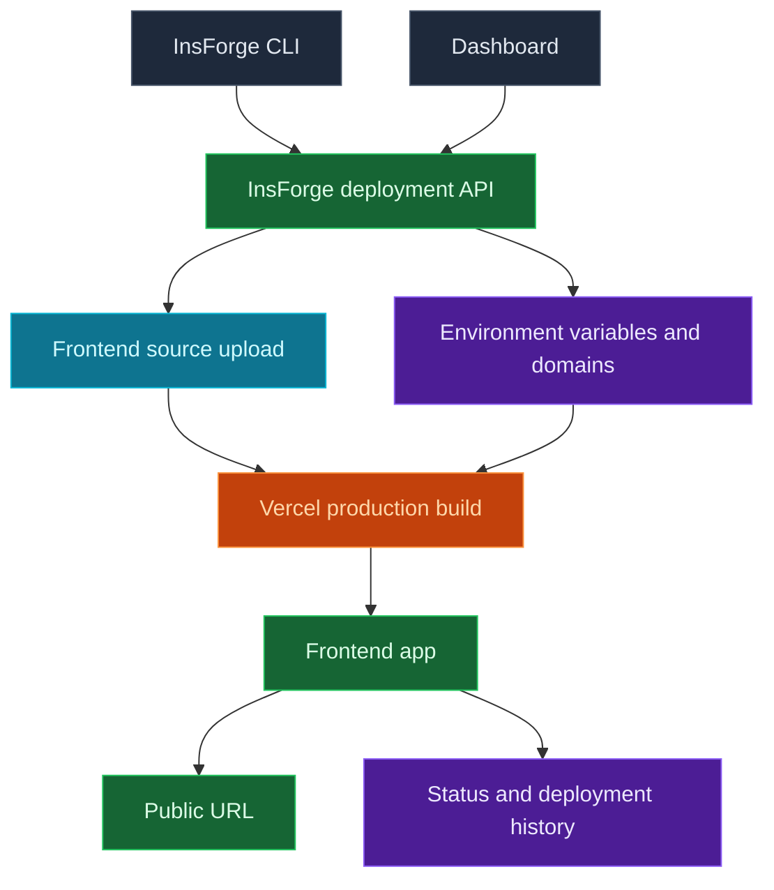

Use InsForge Sites to ship the browser-facing app that belongs to your project. The InsForge CLI uploads your frontend source through InsForge, which creates a Vercel production deployment. The dashboard tracks the URL, status, deployment history, environment variables, and domains.

<Frame caption="Sites dashboard: status, domains, env vars, and deployment history.">
  
</Frame>

<Note>
  **Need to deploy a container or backend service?** Use [Compute](/core-concepts/compute/overview) for workers, queues, WebSocket servers, and long-running services. Sites are for frontend websites and framework builds that produce a hosted web app.
</Note>



## Features

### CLI deploys

Deploy from your app's source directory. The CLI uploads the source tree, skips local-only files such as `node_modules`, `.git`, build output, and `.env` files, then starts the Vercel build through InsForge.

```bash
npx @insforge/cli deployments deploy ./frontend
```

### Framework builds

Deploy React, Vue, Svelte, Next.js, static sites, and other frontend projects. InsForge sends the source files to Vercel, where framework detection and project files such as `package.json` and `vercel.json` decide how the app builds.

### Environment variables

Manage provider environment variables from the dashboard. Use public prefixes such as `VITE_` or `NEXT_PUBLIC_` only for values that are safe to expose in browser code.

```bash
npx @insforge/cli deployments env list
npx @insforge/cli deployments env set VITE_INSFORGE_URL https://your-project.region.insforge.app
npx @insforge/cli deployments env set VITE_INSFORGE_ANON_KEY ik_xxx
```

### Deployment history

Review previous runs, sync Vercel status, inspect metadata, and cancel in-progress deployments from the Deployment Logs page.

```bash
npx @insforge/cli deployments list
npx @insforge/cli deployments status deployment_123 --sync
npx @insforge/cli deployments cancel deployment_123
```

### Domains

Every ready deployment gets a default URL at `https://<appkey>.insforge.site`. You can also set an InsForge-managed slug at `https://<slug>.insforge.site`. For a custom domain, add the domain in the dashboard and configure the DNS record it returns, usually a CNAME for subdomains.

## Deploy with it

<CardGroup cols={2}>
  <Card title="CLI quickstart" icon="terminal" href="/quickstart">
    Connect your project and run InsForge CLI commands from your app directory.
  </Card>
</CardGroup>

## Next steps

- Set up the [CLI](/quickstart) and connect your project.
- Add browser-safe environment variables from the dashboard or with `npx @insforge/cli deployments env set`.
- Run `npx @insforge/cli deployments deploy ./frontend`.
